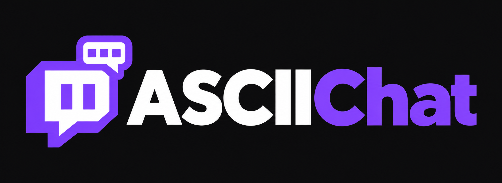

# ASCIIChat



Turn images into text art for Twitch chat. A portable Windows app with a purple interface, local image processing, and Twitch mode enabled by default.

## Download

**[Download ASCIIChat for Windows (64-bit)](https://github.com/Purrty77/ASCIIChat/releases/latest)**

Open the release page, download `ASCIIChat-0.1.2-Windows.exe` under **Assets**, and double-click it. No installer, Node.js, or separate browser is needed. The source-code ZIP is for developers, not the ready-to-run app.

This first version is unsigned. Windows SmartScreen or antivirus software may warn about or block it. macOS and Linux builds are not provided.

## How to use

1. Drop an image into the app, or choose **Try a demo image**.
2. Adjust **Contrast**, **Invert shades**, **Preserve image shading**, and **Enhance details** to get the best result.
3. Click **Copy for Twitch**, then paste directly into chat without a code block.
4. Use **Download .txt** if you want to save the message instead.

Twitch mode is on by default. Check **Disable Twitch mode** to use classic ASCII palettes and larger output; paste classic ASCII into a monospace code block where supported.

## Twitch settings

- **500-character budget:** includes padding and row separators. Copy and download are disabled if the message is too long. **Fit to 500 characters** reduces the width.
- **Art width:** defaults to 20 characters.
- **Padding after username:** defaults to 12 invisible braille characters, leaving space after the username and badges.
- **Restore defaults:** resets width and padding without changing the image or contrast.
- **Preserve image shading:** represents gray tones using dot density. Disable it for a bolder result.
- **Enhance details:** strengthens contrast and edges before conversion.

The preview shows the intended rows. The exported Twitch message has no explicit newlines: spaces between rows allow the chat to wrap it. Chat width, zoom, fonts, badges, and devices can change alignment. Increase padding if the art begins next to your username; reduce width if rows break.

Empty cells inside the art use subtle dots to improve alignment. The username padding remains invisible. The app does not send messages or connect to your Twitch account.

## Getting better results

Simple silhouettes, logos, and high-contrast drawings usually work best. Small photos and faces may lose recognizable details. Try toggling shading and inversion before increasing contrast. Larger output is constrained by chat width and the message limit.

Supported inputs are browser-decodable image formats such as PNG, JPEG, and WebP, up to 20 MB. Output height is capped at 300 rows; extremely tall images may need cropping.

## Privacy and portable files

Image conversion runs locally and works offline. Images are not uploaded or intentionally saved to an image library.

Portable means no installer is required, not that the app writes nothing: it extracts runtime files into Windows temporary storage, and Electron may create app data and cache under `%APPDATA%`. Text files are saved when you choose to download them. Deleting the executable does not necessarily remove caches or app data.

## Development

Use a recent Node.js LTS version and npm:

```sh
npm ci
npm start
```

Run checks:

```sh
npm test
npm run test:desktop
```

Build the Windows x64 portable executable:

```sh
npm run build:win
```

The executable is generated in `dist/`. Build output and dependencies are excluded from Git.

For browser development, run `npm run web` and open http://localhost:3000. The frontend is plain HTML, CSS, and JavaScript; Electron provides the desktop window with Node integration disabled and renderer isolation enabled.

## Project status

Version 0.1.2 includes the app logo, Windows executable icon, clickable GitHub badge, and compact desktop layout. Twitch rendering has been manually tested in one chat configuration, but identical wrapping across all clients is not guaranteed. Updates are manual: download a newer executable from Releases.

ASCIIChat is an independent project and is not affiliated with Twitch.
